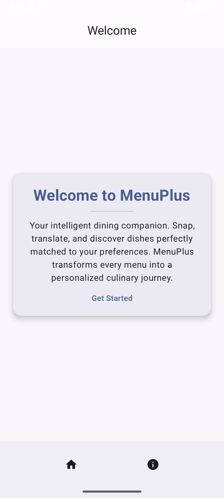
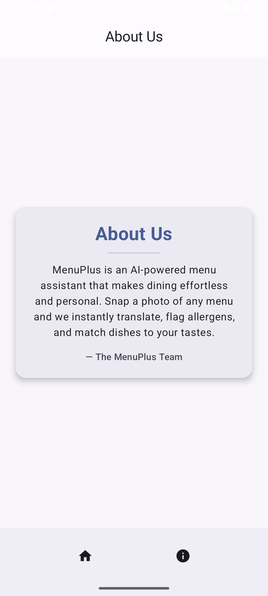

# MenuPlus

## Goal
MenuPlus is an intelligent menu helper app designed to make dining smarter and safer, you should never eat at a restaurant again without it.  
Simply take a picture of a menu, upload it to the app with the restaurant name and some details, and let MenuPlus do the rest.

By combining this with your previously entered preferences, dislikes, dietary restrictions, and allergies, MenuPlus generates a personalized, easy-to-read menu just for you.  
It highlights foods you love, warns you about ingredients you dislike or can’t eat, and even **translates menus** from other languages into your native language.  

The app leverages **AI** to power the translation, allergy detection, and preference-matching logic — all built in **Kotlin** using **Jetpack Compose** for a seamless Android experience.

---

## Quick-start

### Build and Run from Source (by Sprint 1)
1. Clone this repository:
   ```bash
   git clone https://github.com/YOUR-ACTUAL-USERNAME/MenuPlus.git
   cd MenuPlus
   ```

2. Open the project in Android Studio
3. Sync Gradle dependencies
4. Run the app on an emulator or physical device:
   - Click the "Run" button in Android Studio


## Screenshots of application

### Landing Page


### About Us Page



## Team members
Malik Al-Shourbaji - malik.shourbaji@gmail.com
Muhammad Balawal Safdar - muhammadbalawalsafdar@gmail.com
